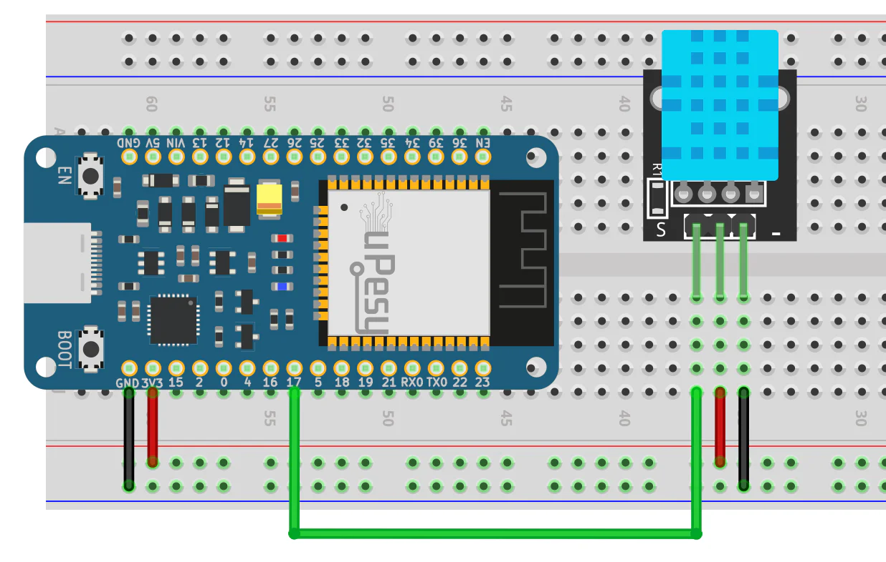
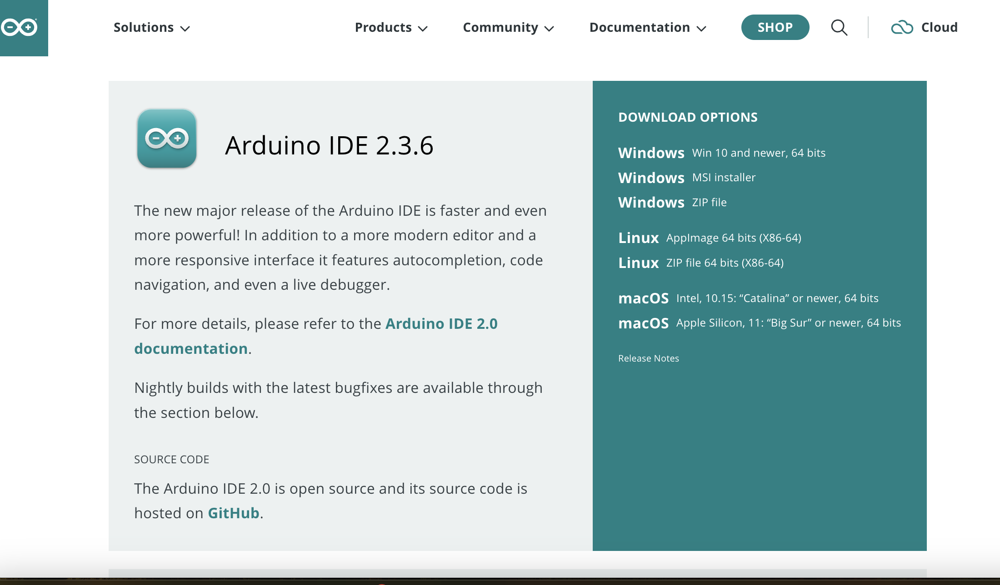
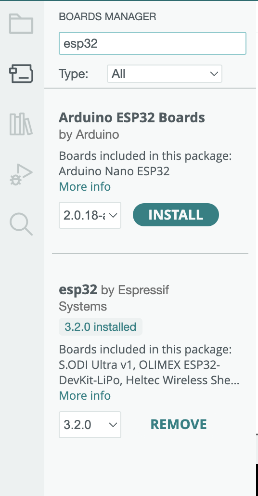
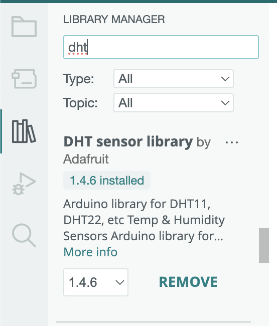
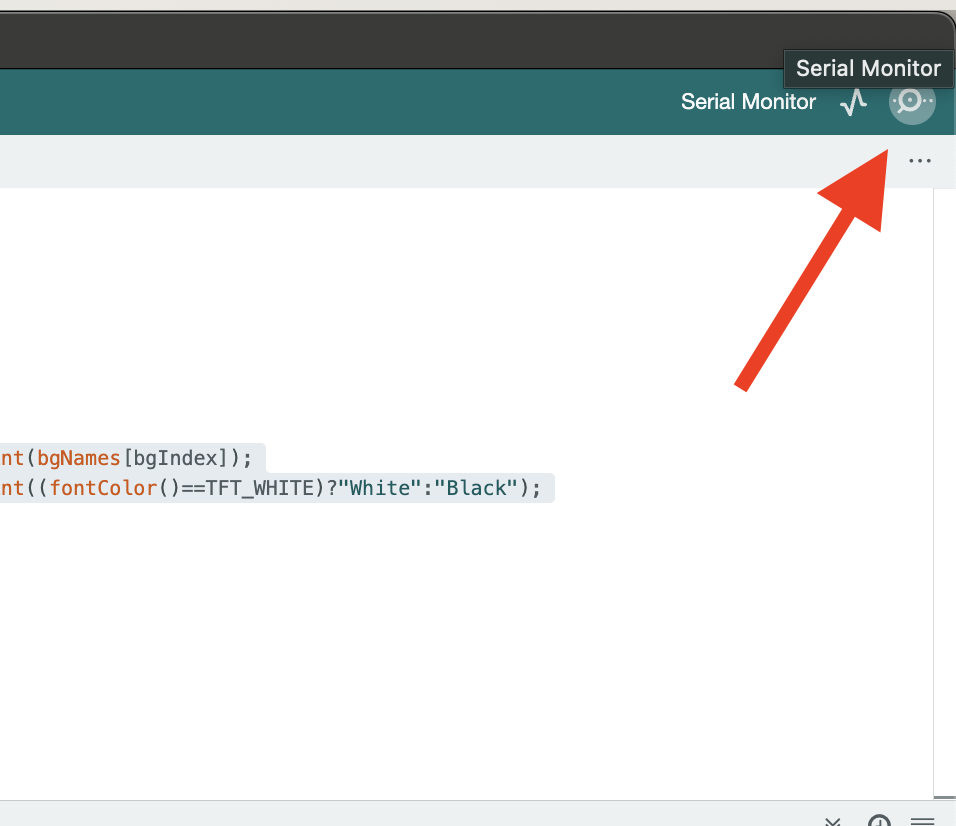
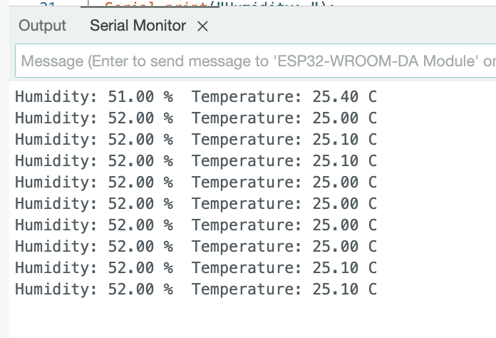

## Introduction
In this tutorial, we will learn how to use a DHT11 sensor with an ESP32 board. We will connect the sensor, read the temperature and humidity, and show the readings on the computer screen. That this can help us to track the indoor environment. By the end, we will know how to add simple sensors to our own projects and knows how the Inter-Integrated Circuit(I2C) works.
### Learning Objectives

* Learn what a DHT11 sensor does
* Learn how to hook up the DHT11 to an ESP32 board
* Install Arduino IDE and add ESP32 support
* Use the DHT library to read sensor data
* Write and run code to print readings to the screen
* Learn what is Inter-Integrated Circuit(I2C)

### Background Information

This tutorial is about the DHT11 sensor and how to use it with the ESP32 board. The DHT11 is a small and cheap sensor that can measure temperature and humidity. It sends this data to the ESP32, which then shows it on the computer screen through the Serial Monitor.

We use the DHT11 because it’s easy to find, low-cost, and simple to use for beginners. There are other sensors like the DHT22 or BME280 that can do the same thing but with better accuracy or extra features. However, the DHT11 is good enough for basic projects.

The DHT11 works by using a special chip inside to measure temperature and humidity from the air. It sends this data as a digital signal to the ESP32 through a single data wire.

- Digital Signal: The DHT11 sends data using 0s and 1s, so the ESP32 can read it.

- Humidity: How much water vapor is in the air.

- Temperature: How hot or cold the air is.

This sensor is useful in weather stations, smart homes, and school projects. It’s a great way to learn how to use sensors with microcontrollers.

## Getting Started

* **Arduino IDE** installed on your computer
* **ESP32 board files** added to the Arduino IDE
* **DHT library** installed in Arduino IDE

1. Go to [https://www.arduino.cc/en/software](https://www.arduino.cc/en/software) and install the Arduino IDE.


2. Go to *Tools > Board > Boards Manager*, search for "ESP32" and install "esp32 by Espressif Systems."


3. Go to *Sketch > Include Library > Manage Libraries*, search for "DHT sensor library" by Adafruit and install it.


### Required Downloads and Installations

List any required downloads and installations here.
Make sure to include tutorials on how to install them.
You can either make your own tutorials or include a link to them.


### Required Components

List your required hardware components and the quantities here.

| Component Name      | Quantity |
| ------------------- | -------- |
| ESP32 Dev Board     | 1        |
| DHT11 Sensor        | 1        |
| Breadboard          | 1        |
| Jumper Wires        | 3        |


### Required Tools and Equipment

* USB cable for the ESP32
* A computer with Windows, macOS, or Linux

## Part 01: Name

### Introduction

Briefly introduce what  you are teaching in this section.

In this part, you will wire the DHT11 to the ESP32 and run a simple program to read data.

### Objective

- Learn how to connect the DHT11 sensor to the ESP32 board

- Understand which pins to use for power, ground, and data

- Upload and run a basic program that reads sensor values

- Open the Serial Monitor to see temperature and humidity results

- Make sure the code works and can handle errors when the sensor is not working


### Background Information

I2C (Inter-Integrated Circuit) is a way for tiny computer parts like sensors and displays to talk to a main chip using just two wires—one for data and one for timing. It lets many devices share the same wires without crashing into each other, like students politely taking turns to speak in class. The DHT11 needs a pull-up resistor on the data pin and sends data in a timing-based format. Our code waits between readings to keep the data correct.

### Components

- ESP32 Dev Board
- DHT11 Sensor
- Breadboard
- Jumper Wires

### Instructional

1. Connect VCC on the DHT11 to 3.3 V on the ESP32.
2. Connect GND on the DHT11 to GND on the ESP32.
3. Connect the data pin on the DHT11 to GPIO 15 on the ESP32.

5. Open Arduino IDE. Copy and paste the code below.
6. Select *ESP32 Dev Module* under *Tools > Board* and the correct port under *Tools > Port*.
7. Click upload. Then open the Serial Monitor at 115200 baud.

```cpp
#include "DHT.h"

#define DHTPIN 15
#define DHTTYPE DHT11

DHT dht(DHTPIN, DHTTYPE);

void setup() {
  Serial.begin(115200);
  dht.begin();
}

void loop() {
  delay(2000);
  float h = dht.readHumidity();
  float t = dht.readTemperature();
  if (isnan(h) || isnan(t)) {
    Serial.println("Failed to read sensor");
    return;
  }
  Serial.print("Humidity: ");
  Serial.print(h);
  Serial.print(" %  ");
  Serial.print("Temperature: ");
  Serial.print(t);
  Serial.println(" C");
}
```

## Example

You will this see in the Serial Monitor.

```
Humidity: 38.21 %  Temperature: 22.17 C
Humidity: 37.30 %  Temperature: 22.11 C
```
This is the photo in my Monitor:


### Analysis

* We wait 2 seconds between readings so the sensor is ready.
* If the sensor fails, the code prints an error message.
* Therefore, we finished it.

## Additional Resources

### Useful links

* Adafruit DHT Guide: [https://learn.adafruit.com/dht](https://learn.adafruit.com/dht)
* ESP32 Setup Guide: [https://docs.espressif.com/projects/arduino-esp32](https://docs.espressif.com/projects/arduino-esp32)
* DHT11 Datasheet
